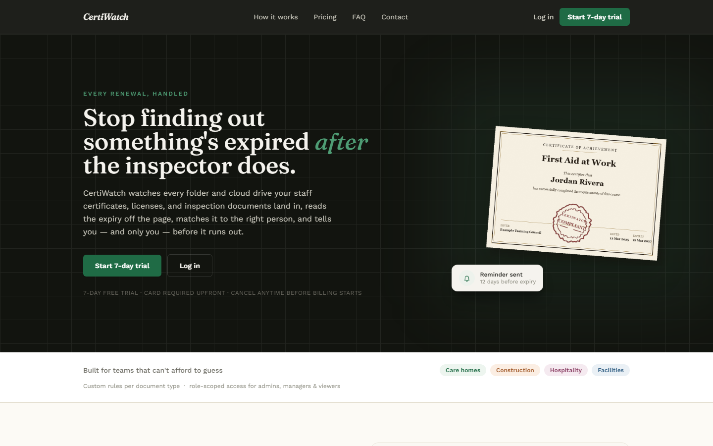
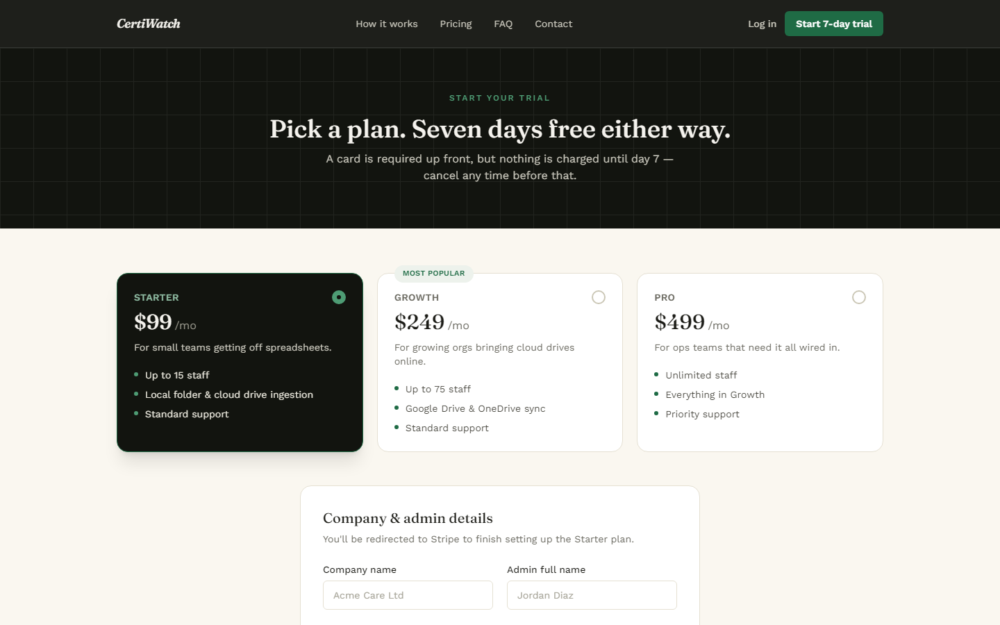
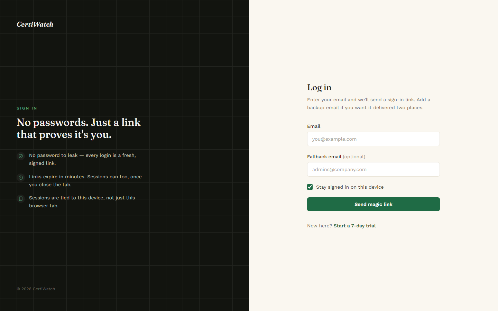
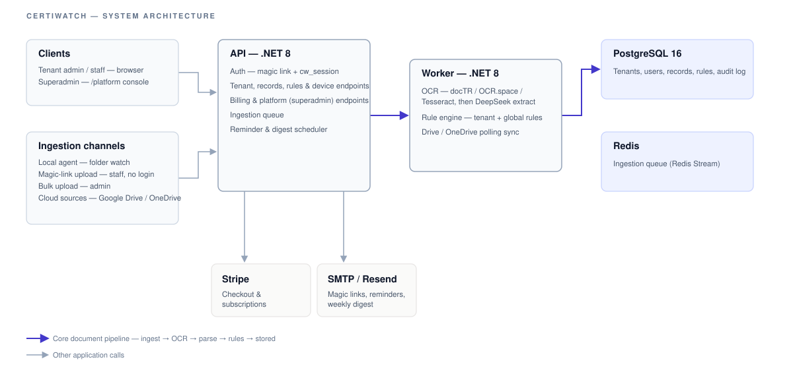

# CertiWatch

**CertiWatch is a multi-tenant SaaS platform that stops a business from finding out a staff certificate has expired only after an inspector, auditor, or client asks for it.**

It's built for organizations that are legally or contractually required to keep every member of staff currently certified in things like First Aid, Fire Safety, Manual Handling, Safeguarding, or a DBS check — care homes, construction firms, and hospitality businesses being the typical case. Today, most of them track this in a spreadsheet someone has to remember to update. CertiWatch replaces that spreadsheet: point it at wherever your certificates already land, and it reads them, tracks who's covered for what, and tells you before something lapses — not after.

As a SaaS product, every tenant (a care home, a construction firm, whoever signs up) gets its own isolated data and its own subscription, self-served through Stripe Checkout with a 7-day trial — there's no per-customer deployment or manual setup. A separate superadmin console (`/platform`) lets CertiWatch's own operators manage every tenant, billing, and support ticket from one place.

## What it actually does, in plain terms

1. **You give it somewhere to watch.** A folder on your own computer or network (via a small local agent), a connected Google Drive or OneDrive folder, or just a link staff can drop a file into directly — no login required on their end.
2. **It reads the certificate.** OCR pulls the raw text off the scan or PDF, and a structured-extraction step figures out who it belongs to, what course/qualification it's for, who issued it, and the issue/expiry dates.
3. **It works out when it actually expires.** A rule engine resolves the real validity period for that course — tenant-specific overrides take precedence over sane global defaults — rather than guessing. Anything it isn't confident about lands in a review queue for a human to check, instead of being silently accepted or dropped.
4. **You see it on one screen.** A live compliance matrix shows every active staff member against every requirement your organization tracks — compliant, expiring soon, or expired — searchable, filterable, and exportable as a CSV or a print-ready audit report.
5. **It reminds people before it's a problem.** A weekly digest plus configurable expiry reminders go out by email, timed to actually give someone time to act.

## Screenshots

The marketing site and auth screens (public, no login needed to view):

| Landing page | Sign up | Log in |
|---|---|---|
| [](docs/assets/screenshots/landing.png) | [](docs/assets/screenshots/signup.png) | [](docs/assets/screenshots/login.png) |

The tenant dashboard (compliance matrix, records, review queue, sources) and the `/platform`
superadmin console both sit behind a real login with no password — a magic link sent by real
email, since this project doesn't have a fabricated dev-login bypass. Screenshots of those aren't
included here for that reason; run the app yourself (see Quickstart below) to see them.

## How ingestion actually works (the part that's easy to get wrong)

There are four separate ways a document can get into CertiWatch, and they behave differently on purpose:

| Path | What it is | Where the file ends up |
|---|---|---|
| **Local folder agent** (`apps/agent`) | A small, self-enrolling service you install on a staff machine or NAS. It only watches a folder and uploads new files — it does no OCR itself. | Archived in CertiWatch's own storage (there's no other durable place to read it back from later). |
| **Staff upload link** | A short-lived, no-login link an admin generates and sends to one person. | If the tenant has a Google Drive or OneDrive folder connected, the file is saved straight there. Otherwise, it's archived in CertiWatch's own storage. |
| **Upload page** | An admin bulk-uploading a backlog of paper certificates at once. | Same rule as the staff upload link. |
| **Connected Google Drive / OneDrive folder** | The tenant picks a folder they already use; CertiWatch polls it for new files. | **Never archived.** CertiWatch reads the file live from the tenant's own Drive/OneDrive whenever it's actually needed (during extraction, or when a human opens it on the review screen) and keeps only a reference, not a copy. |

That last row is deliberate: for a compliance product that's already asking businesses to trust it with staff records, holding a duplicate copy of every certificate we don't need to hold is unnecessary risk and unnecessary storage cost. If a tenant has a Drive/OneDrive folder connected, direct uploads route there too, by the same reasoning — Google Drive is preferred by default when both are connected, but an admin can pick OneDrive instead from the Sources page. Without either connected, everything falls back to CertiWatch's own storage (currently Cloudflare R2, isolated per tenant by a key prefix within one shared bucket), and nothing about that is hidden from the tenant — see the in-app documentation and the landing page's own FAQ for how this is explained to a customer.

## OCR & extraction pipeline

Reading a real-world scan reliably takes more than one pass:

1. **Raw text extraction** — the worker tries docTR (a FastAPI sidecar, `apps/ocr-doctr`) first for the best accuracy, falls back to OCR.space if configured, and falls back again to bundled Tesseract + poppler if neither is available. A PDF's own embedded text layer (if it has one) is extracted separately and merged in, since OCR alone can miss text a PDF already carries natively.
2. **Structured extraction** — that raw text is sent to DeepSeek to pull out staff name, course name, issuer, issue date, and expiry date as structured fields, with a keyword/regex-based heuristic pass as a backup for anything the model misses.
3. **Multi-certificate PDFs are split per page** — a single file containing several people's certificates (a council exporting one staff member's whole training history into one PDF, for example) is processed page-by-page, so each page becomes its own record instead of one document swallowing several people's data.
4. **Low-confidence or incomplete extractions are held for review**, not guessed at or silently dropped.

## Key features

**Ingestion** — local folder agent, no-login staff upload link, bulk upload page, Google Drive & OneDrive connectors with a real folder picker (not a pasted folder ID) and the reference-only storage behavior described above.

**OCR & extraction** — docTR / OCR.space / Tesseract with automatic fallback, DeepSeek structured extraction, per-page handling of multi-certificate PDFs, and a confidence-gated review queue.

**Compliance rules & records** — a rule engine that resolves course validity with tenant-specific rules taking precedence over global defaults (tenant exact match → tenant vendor/regex → global equivalents → tag → fallback); a live compliance matrix; CSV and print-ready HTML exports that mirror exactly what's on screen, including whatever filter was applied.

**Notifications** — a weekly digest plus configurable per-tenant expiry reminder lead times (defaults to 60/30/7/1 days out), with reminder emails going out for real, not just logged, once SMTP is configured.

**Team & access control** — three roles (admin, manager, viewer); a manager sees their own scope by default (records they created, or that a viewer they invited created) but a tenant admin can flip a tenant-wide switch to let managers see everything, and individual sources/devices can be marked "shared with all managers" so a genuinely shared resource (like one shared Google Drive the whole team drops files into) doesn't get siloed to whoever happened to connect it first.

**Billing** — self-serve Stripe Checkout, three plans sized by staff headcount (Starter: up to 15 staff, Growth: up to 75, Pro: unlimited) rather than a raw upload count. The underlying allowance is a count of distinct staff+requirement pairs being tracked, not raw documents — renewing a certificate you already track never counts against the limit, only a genuinely new person or requirement does.

**Platform console (superadmin)** — cross-tenant admin at `/platform`: tenant list/detail (suspend/resume, subscription status, audit trail), the ability to grant a tenant free pilot access for a set number of days without needing a card on file, Stripe billing operations, a usage & health dashboard, support ticket triage across every tenant, and a security view of audit logs/login activity.

**Devices** — a local agent enrolls with a short-lived, tenant-scoped one-time code (minted by a tenant admin) rather than a shared static secret, and authenticates every call afterward with its own device token.

## Architecture



| Component | Role |
|---|---|
| **Frontend** (`apps/frontend`) | Next.js 15 — the tenant dashboard (records, compliance, staff, requirements, sources, billing, etc.), the public marketing site, and the `/platform` superadmin console. |
| **API** (`apps/api`) | .NET 8 minimal API, vertical-slice layout under `Features/` — auth, tenant/records/rules/device/billing/platform endpoints, OAuth flows for Google Drive/OneDrive, and the ingestion queue producer. |
| **Worker** (`apps/worker`) | .NET 8 background service that runs **server-side**: OCR + DeepSeek extraction on anything the queue hands it, and the periodic Google Drive/OneDrive polling that pulls new files in from a connected folder. Not the same thing as the agent below. |
| **Agent** (`apps/agent`) | A separate, much smaller service installed **on a customer's own machine or NAS**. It only watches a local folder and uploads new files it finds — it does no OCR itself; that happens server-side once the file reaches the worker. |
| **OCR sidecars** (`apps/ocr-doctr`, `apps/ocr-paddle`) | FastAPI services the worker calls out to for higher-accuracy extraction than its bundled Tesseract fallback. |
| **PostgreSQL** | Primary data store — tenants, users, devices, sources, documents, records, requirement types, audit log. |
| **Redis** | Backs the ingestion queue (a Redis Stream with a consumer group, not just a cache) between the API and the worker. |
| **Cloudflare R2** | Where documents get archived when there's no tenant-connected Drive/OneDrive to route them to instead (see the ingestion table above). |
| **Stripe** | Checkout + subscription billing. |
| **SMTP** | Delivers magic-link logins, invites, expiry reminders, and the weekly digest. Without SMTP configured, these are logged instead of sent — see the Docker quickstart below. |

## Stack

.NET 8 (API + worker + agent, all C#), Next.js 15 (frontend), PostgreSQL 16, Redis (ingestion queue), OCR via docTR/OCR.space/Tesseract with DeepSeek for structured extraction, Cloudflare R2 for document storage, Stripe for billing. See `docs/security.md` for the current security posture.

## Project layout

```
apps/
  api/          .NET 8 minimal API - the backend everything talks to
  worker/       .NET 8 background service - OCR, extraction, and cloud-drive polling
  agent/        .NET 8 service installed on a customer's own machine/NAS
  frontend/     Next.js 15 - tenant dashboard, marketing site, platform console
  ocr-doctr/    FastAPI OCR sidecar (docTR)
  ocr-paddle/   FastAPI OCR sidecar (PaddleOCR)
packages/
  contracts/    Shared DTOs/events/enums used by api, worker, and agent
  storage/      IFileStorage abstraction (local disk / Cloudflare R2)
docs/           Setup, API reference, agent install, security, troubleshooting
terraform/      Infrastructure-as-code (Azure Container Apps + Cloudflare)
```

## Quickstart (local development)

```bash
# bootstrap postgres + redis + hot reload services
scripts/dev.sh

# apply EF Core migrations
scripts/migrate.sh
# optional sample data
# scripts/seed.sh

# frontend dev server
cd apps/frontend
npm install
npm run dev
```

See `docs/setup.md` for environment prep, `docs/api.md` for endpoint contracts, `docs/agent-install.md` for packaging/installing the local agent, and `docs/onboarding.md` for the billing/onboarding sequence.

## Testing

The same three commands CI runs on every push to `main` (`.github/workflows/ci.yml`):

```bash
# .NET - api, worker, agent, and the shared contracts/storage/parsing packages
dotnet test

# frontend unit tests
cd apps/frontend
npm run test

# end-to-end (builds the frontend first, then drives it with a real browser)
npm run test:e2e
```

## Docker quickstart

The easiest way to run the whole stack locally — API on 5002, frontend on 3300, Postgres/Redis, worker inside the network:

```bash
cp .env.docker.example .env    # fill in Stripe price IDs and SMTP credentials if you have them
docker compose up --build
```

The example file covers Stripe, email, worker device credentials, and DeepSeek. A few optional
features need extra vars it doesn't include, added directly to `.env` if you want them: Cloudflare
R2 storage (`Storage__Provider=R2` plus `Storage__R2__AccountId`/`AccessKeyId`/`SecretAccessKey`/
`BucketName` — defaults to local disk without these), and Google/Microsoft OAuth for the Drive/
OneDrive connectors (`GOOGLE_OAUTH_CLIENT_ID`, `GOOGLE_OAUTH_CLIENT_SECRET`,
`MICROSOFT_OAUTH_CLIENT_ID`, `MICROSOFT_OAUTH_CLIENT_SECRET` — `docker-compose.yml` feeds each of
these into both the API and the worker automatically, so they only need setting once).

If you don't have device credentials yet, start the API container, then from the host run:

```bash
curl -X POST http://localhost:5002/api/devices/enroll \
  -H "Content-Type: application/json" \
  -d '{ "deviceName": "local-worker", "operatingSystem": "docker", "enrollmentCode": "local-dev" }'
```

`local-dev` is seeded by `scripts/seed.sql` for the dev tenant and never expires — it's only meant for local development. For a real tenant, mint a fresh code (as a logged-in tenant admin) via `POST /api/devices/enrollment-codes` and use that instead — each code is revoked as soon as a new one is minted, and expires after 24 hours.

Copy the returned `deviceId`/`deviceToken` into `.env` (`WORKER__DeviceId` / `WORKER__DeviceToken`) and re-run `docker compose up` to bring the worker online.

**Keeping your local Docker stack in sync with `main`:** `git push` only updates GitHub — it doesn't touch anything running on your machine, since `docker-compose.yml` builds images from your local checkout rather than pulling from a registry. Run `scripts/update-local.sh` to pull the latest `main`, apply any new EF Core migrations, and rebuild/restart the containers in one step. It refuses to run if you have uncommitted local changes, so it won't clobber work in progress.

### Billing in Docker
- Frontend: http://localhost:3300, API: http://localhost:5002.
- Set Stripe envs in `.env` (`Stripe__SecretKey`, `Stripe__WebhookSecret`, plan price IDs) and `NEXT_PUBLIC_STRIPE_PUBLISHABLE_KEY`.
- Run the Stripe CLI locally: `stripe listen --forward-to http://localhost:5002/api/billing/webhook` and use the printed `whsec`.
- Trigger a test session with `stripe trigger checkout.session.completed`.

### Google Drive / OneDrive in Docker
- Both need a real OAuth app registration in Google Cloud Console / Azure AD, with the resulting client ID/secret set as `GOOGLE_OAUTH_CLIENT_ID`/`GOOGLE_OAUTH_CLIENT_SECRET` and `MICROSOFT_OAUTH_CLIENT_ID`/`MICROSOFT_OAUTH_CLIENT_SECRET` in `.env` (not covered by `.env.docker.example` — add them directly).
- The Google Drive folder picker (`NEXT_PUBLIC_GOOGLE_CLIENT_ID` / `NEXT_PUBLIC_GOOGLE_PICKER_API_KEY`) is optional; without it, folder selection falls back to pasting a folder ID.

### Auth defaults
- Magic links are short-lived; the session cookie is long-lived (30 days) when "stay signed in" is checked.
- Login requires an existing user; unknown emails return a friendly 400 ("We couldn't find that email. Please sign up to start your trial."). New users join via signup (Stripe) or admin invite.
- **No real emails without real SMTP credentials.** With `Email__SmtpHost` unset (the default), magic links, invites, and reminders are logged instead of sent — run `docker compose logs -f api` and grab the `/magic?token=...` link out of the `[Email] (debug) Body:` line. Set `Email__SmtpHost` / `Email__SmtpUsername` / `Email__SmtpPassword` in `.env` once you have real SMTP credentials to actually receive them.

## Billing & tenant provisioning

Signup is self-serve via Stripe:

1. **Stripe config** — populate the `Stripe` section in `apps/api/appsettings.json` (or the matching `.env` vars in Docker) with secret/publishable/webhook keys and price IDs per plan.
2. **Frontend env** — set `NEXT_PUBLIC_STRIPE_PUBLISHABLE_KEY`.
3. **Signup page** — visit `/signup`, choose a plan, enter company/admin info. The UI calls `POST /api/billing/checkout`, gets a Checkout Session URL back, and redirects to Stripe.
4. **Webhook** — locally, use the Stripe CLI: `stripe listen --forward-to <api-url>/api/billing/webhook`. On `checkout.session.completed`, the API provisions a tenant plus its first admin.
5. **Login** — provisioned admins sign in via magic link (no password). Plan metadata lives on the tenant and is enforced against the staff-headcount-based allowance described above.

## Deployment

Terraform for an Azure Container Apps + Cloudflare deployment lives under `/terraform`. This isn't the only supported path — the Docker Compose setup above is also a complete, self-contained way to run every service (including the worker and OCR sidecars) on a single host. Pick whichever matches where you're actually hosting.

## Documentation index

- `docs/setup.md` — local & cloud setup
- `docs/onboarding.md` — Stripe signup + onboarding sequence
- `docs/api.md` — endpoint contracts
- `docs/agent-install.md` — Windows/Linux/macOS local agent install
- `docs/security.md` — security posture
- `docs/troubleshooting.md` — common issues

This README is the map. Feature deep dives, operator guides, and anything that changes often enough to go stale in a README live under `/docs` instead.
