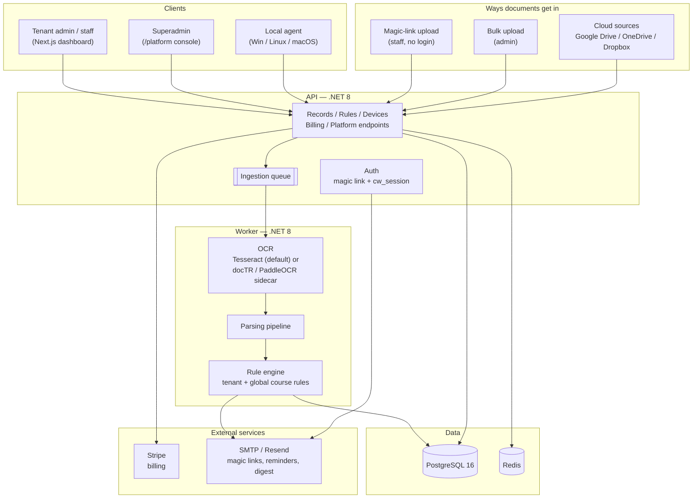

# CertiWatch

CertiWatch is a SaaS certificate-compliance platform for SMBs — it tracks who on staff is trained/certified in what, and chases the paperwork before it lapses. A local agent or cloud connector watches for new certificate documents, OCR + parsing pulls out staff/course/issuer/expiry data, a rule engine works out when each certificate actually expires, and admins get a live dashboard plus reminders/digests so nothing quietly goes out of date.

Typical customer: a care home, construction firm, or hospitality business that has to prove (to a regulator, an insurer, or a client) that every member of staff is currently certified in First Aid, Fire Safety, Manual Handling, Safeguarding, and similar — and currently tracks it in a spreadsheet.

## What it does

- **Ingest** — a lightweight local agent watches folders (and, going forward, cloud drives) for new scans/PDFs; staff can also upload directly via a one-time magic link, or an admin can bulk-upload a folder of certificates at once.
- **Read** — a worker pipeline runs OCR (Tesseract by default, with an optional docTR/PaddleOCR sidecar for better accuracy) and extracts staff name, course, issuer, issue date, and expiry.
- **Decide** — a rule engine resolves the actual validity period for each course (tenant-specific rules override global defaults; unmatched/low-confidence extractions are flagged for manual review instead of guessed at silently).
- **Track** — a records dashboard shows every certificate's status at a glance, with CSV/PDF export and an analytics view of compliance across the team.
- **Remind** — a weekly digest and configurable expiry reminders go out by email so renewals happen before a certificate lapses, not after.

## Features

**Ingestion**
- Local device agent (Windows/Linux/macOS) that watches folders and pushes new documents to the API — see `docs/agent-install.md`.
- Manual staff upload via a short-lived, no-login magic link (an admin generates the link, the staff member just drops their file in).
- Bulk upload for admins clearing a backlog of paper certificates at once.
- Cloud source connectors (Google Drive, OneDrive, Dropbox) as a source type alongside local folders.

**OCR & extraction**
- Tesseract + poppler by default; an optional docTR/PaddleOCR FastAPI sidecar for higher-accuracy extraction on harder scans.
- Keyword- and vendor-aware parsing pipeline that pulls staff name, course, issuer, issue date, and expiry out of raw OCR text.
- Documents that don't clear a confidence threshold land in a **Needs review** queue instead of being silently accepted or dropped.

**Compliance rules & records**
- A rule engine resolves course validity with tenant rules taking precedence over global defaults (tenant exact match → tenant vendor/regex → global equivalents → tag → fallback).
- Records dashboard with search/filter, CSV and PDF export, and a review-count badge for anything needing a human look.
- Analytics view of certificate status and compliance trends across the organization.

**Notifications**
- Weekly digest email summarizing what's expiring soon.
- Configurable expiry reminder emails per course/tenant.
- Templates live in `/emails` (digest, reminder, magic-link, welcome).

**Team & access**
- Role-based access: **admin** (full tenant control), **manager** (invites and sees their own team's records), **viewer** (their own uploads only).
- Email invites for new team members; magic-link login (no passwords) with a "stay signed in" long-lived session option.
- Per-tenant support tickets for reaching CertiWatch support.

**Billing**
- Self-serve Stripe Checkout signup with three plans (Starter/Growth/Pro, record-limit based) — see `docs/onboarding.md`.
- In-app plan page for viewing/changing subscription state.

**Platform console (superadmin)**
- Cross-tenant admin at `/platform`: tenant list/detail (suspend/resume, API keys, audit trail), Stripe billing operations (subscriptions, invoices, credits, plan moves), usage & health dashboard (queue depth, OCR/worker/Postgres/Redis status), support ticket triage across all tenants, and a security view of audit logs/login activity.

**Devices**
- Local agents enroll using a short-lived, tenant-scoped enrollment code (minted by a tenant admin) rather than a static shared secret, and authenticate every subsequent call with their own device token.

## Stack

.NET 8 modular API + worker, cross-platform agent, Next.js 15 admin UI, PostgreSQL 16 + Redis, OCR via Tesseract/docTR/PaddleOCR, Stripe billing, Azure Container Apps + Cloudflare in front for production. See `docs/security.md` for the current security posture.

## Architecture



**Components**

| Component | Role |
|---|---|
| **Frontend** (`apps/frontend`) | Next.js 15 app — the tenant dashboard (records, rules, team, billing, etc.) and the `/platform` superadmin console. |
| **API** (`apps/api`) | .NET 8 minimal API — auth, tenant/records/rules/device/billing/platform endpoints, and the ingestion queue. Vertical-slice layout under `Features/`. |
| **Worker** (`apps/worker`) | .NET 8 background service — pulls queued documents, calls OCR, runs the parsing pipeline, resolves the rule engine, and writes records. |
| **Agent** (`apps/agent`) | Cross-platform local service — watches folders on a staff machine/NAS and pushes new documents to the API using a per-device token. |
| **OCR** (`apps/ocr-doctr`, `apps/ocr-paddle`) | FastAPI sidecars used when higher-accuracy extraction is needed than the worker's built-in Tesseract. |
| **Postgres** | Primary data store — tenants, users, devices, documents, records, rules, audit log. |
| **Redis** | Cache/queue support alongside Postgres. |
| **Stripe** | Checkout + subscription billing. |
| **SMTP/Resend** | Delivers magic-link logins, expiry reminders, and the weekly digest. |

**Implementation notes**
- **Billing**: `/api/billing/checkout` creates Checkout Sessions; `/api/billing/webhook` verifies signatures and provisions tenants.
- **Rules & records**: global+tenant rule precedence with automatic reprocessing.
- **Notifications**: weekly digest + configurable expiry reminders (mail templates live in `/emails`).
- **Deploy**: Terraform under `/terraform` targets Azure Container Apps behind Cloudflare; CI/CD in `.github/workflows/ci.yml` (lint, tests, docker build, security scans, terraform plan).
- **OCR defaults**: worker runs Tesseract + poppler and can call a docTR sidecar (FastAPI, `apps/ocr-doctr`) for higher-quality OCR. For host-native runs install `tesseract-ocr` and `poppler-utils`; cloud OCR (Azure/GCP/etc.) is optional via env vars.

## Quickstart

```bash
# bootstrap postgres + redis + hot reload services
scripts/dev.sh

# apply EF Core migrations
scripts/migrate.sh
# optional sample data
# scripts/seed.sh

# run backend tests
dotnet test

# frontend dev server
cd apps/frontend
npm install
npm run dev
```

See `/docs/setup.md` for environment prep, `/docs/api.md` for endpoints, `/docs/agent-install.md` for agent packaging, and `/docs/onboarding.md` for billing/onboarding.

## Billing & tenant provisioning

Signup is self-serve via Stripe:

1. **Stripe config** – populate the `Stripe` section in `apps/api/appsettings.json` with secret/publishable/webhook keys and price IDs per plan.
2. **Frontend env** – set `NEXT_PUBLIC_STRIPE_PUBLISHABLE_KEY` (see `apps/frontend/.env.example`).
3. **Signup page** – visit `http://localhost:3000/signup`, choose a plan, enter company/admin info. The UI calls `POST /api/billing/checkout`, receives a Checkout Session URL, and redirects to Stripe.
4. **Webhook** – use Stripe CLI locally: `stripe listen --forward-to http://localhost:5001/api/billing/webhook`. On `checkout.session.completed`, the API provisions a tenant + first admin via `TenantProvisioningService`.
5. **Login** – provisioned admins sign in via magic link (no password). Plan metadata is stored on the tenant and enforced against record limits.

## Documentation index

- `docs/setup.md` – local & cloud setup
- `docs/onboarding.md` – Stripe signup + onboarding sequence
- `docs/api.md` – endpoint contracts
- `docs/agent-install.md` – Windows/Linux/macOS service install
- `docs/security.md` – security posture
- `docs/troubleshooting.md` – common issues

This README serves as the technical high-level. Feature deep dives, operator guides, and future milestones live under `/docs`.

## Docker quickstart

Use Docker to run the stack locally (API on 5002, frontend on 3000, Postgres/Redis, worker inside the network):

```bash
cp .env.docker.example .env    # fill Stripe, email SMTP, worker device IDs if you have them
docker compose up --build
```

If you don’t have device credentials yet, start the API container, then from host run:

```bash
curl -X POST http://localhost:5002/api/devices/enroll \
  -H "Content-Type: application/json" \
  -d '{ "deviceName": "local-worker", "operatingSystem": "docker", "enrollmentCode": "local-dev" }'
```

`local-dev` is seeded by `scripts/seed.sql` for the dev tenant and never expires - it's only meant
for local development. For a real tenant, mint a fresh code (as a logged-in tenant admin) via
`POST /api/devices/enrollment-codes` and use that instead - each code is revoked as soon as a new
one is minted, and expires after 24 hours.

Copy the returned `deviceId`/`deviceToken` into `.env` (`WORKER__DeviceId` / `WORKER__DeviceToken`) and re-run `docker compose up` to bring the worker online.

Billing in Docker:
- Frontend: http://localhost:3300, API: http://localhost:5002.
- Set Stripe envs in `.env` (`Stripe__SecretKey`, `Stripe__WebhookSecret`, plan price IDs) and `NEXT_PUBLIC_STRIPE_PUBLISHABLE_KEY`.
- Run Stripe CLI locally: `stripe listen --forward-to http://localhost:5002/api/billing/webhook` and use the printed `whsec`.
- You can trigger a session for testing with `stripe trigger checkout.session.completed`.

Auth defaults:
- Magic links are short-lived; the session cookie is long-lived (30 days) when “stay signed in” is checked.
- Links can be sent to a fallback org email; the session is bound to a device identifier cookie (`cw_device`).
- Login flow requires an existing user; unknown emails return a friendly 400 (“We couldn't find that email. Please sign up to start your trial.”). New users join via signup (Stripe) or admin invite.
